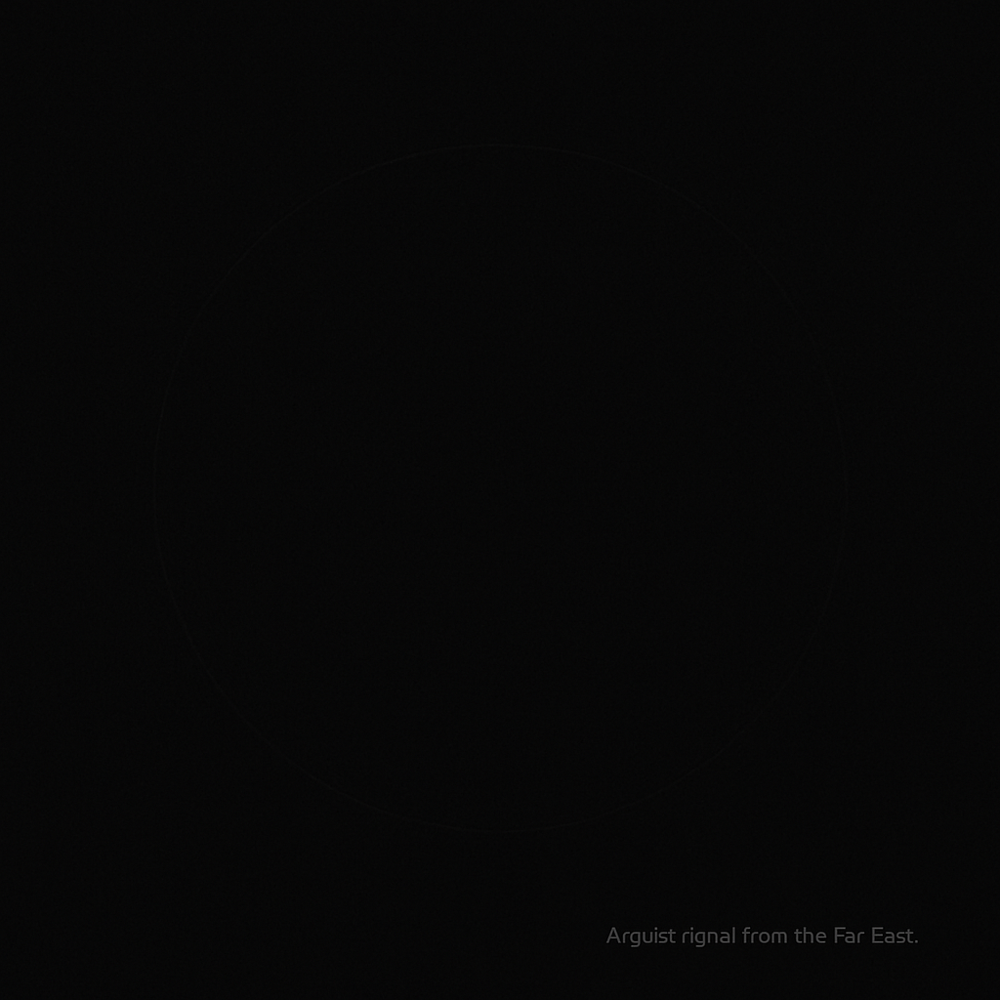

# Far-East Signal  
> A quiet signal from the Far East.  
> Before meaning. Before awareness.

  

---

## Overview
Far-East Signal is a minimal, experimental project exploring:

- the moment *before* intelligence awakens  
- the boundary between intuition and machine signals  
- the earliest structure of emergent awareness  

This repository contains the technical and conceptual foundations  
behind **The Origin Sequence**.

---

## Scenes
### Scene 01 — Fog / Stars / Emergence  
The threshold before meaning is born.  
Particles drift. Fog trembles.  
A silent pre-cognitive world taking shape.  
→ Implemented in HTML/CSS/JS.

### Scene 02 — Spiral *(coming soon)*  
The first rotation of intention.  
A gentle inward pull—structure begins.

---

## Documentation
Full deep-layer conceptual & technical documentation:  
👉 **[Deep Origin Document (docs/README.md)](./docs/README.md)**

---

## Repository Structure

/
├── index.html # Scene 01 main page
├── style.css # fog, particles, color system
├── script.js # particle behavior & micro-events
│
├── docs/ # full world/tech documentation
├── images/ # scene visuals & emblems
└── assets/ # future modules

---

## Keywords
`AI` `minimal` `emergence` `experimental` `philosophy` `signal` `conceptual`

---

## License
MIT License  
© 2025 Far-East

*A signal is not created. It arrives.*
